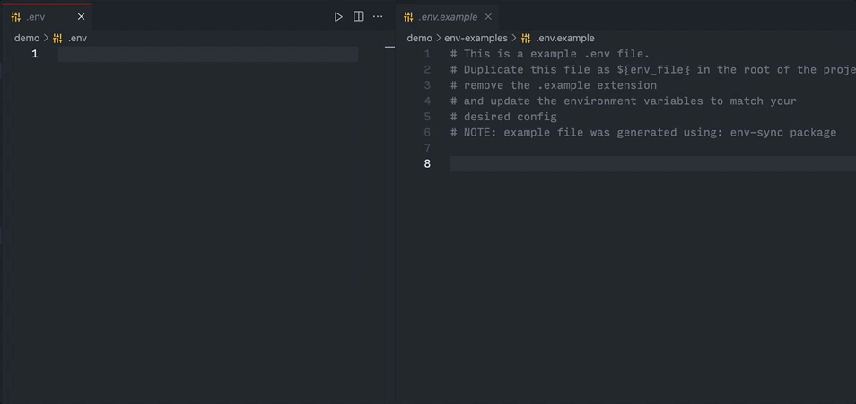

# env-sync

`env-sync` automates the process of syncing and saving examples of all your
`env` files. No more manually updating env samples



## Installation

```bash
$ npm install @ize-302/env-sync -g
```

Install as a dev dependency (**recommended**)

```bash
$ npm install @ize-302/env-sync -D
```

## Usage

1. Insert as script command

```js
// package.json
{
  "scripts": {
    "env": "@ize-302/env-sync"
  }
}
```

2. Run it

```bash
$ npm run env
```
